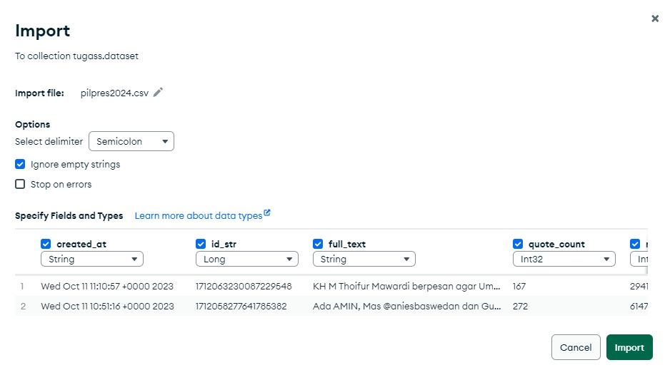
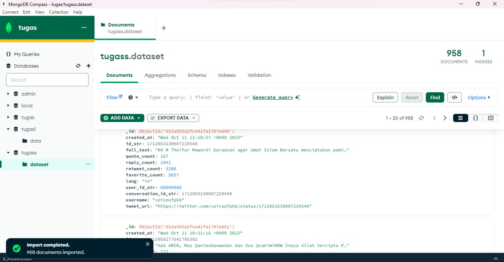

# Tugas1_BigData

## Tutorial_Crawling_Data

# Impor package Python yang diperlukan
!pip install pandas

# Instal Node.js (karena tweet-harvest dibangun menggunakan Node.js)
!sudo apt-get update
!sudo apt-get install -y ca-certificates curl gnupg
!sudo mkdir -p /etc/apt/keyrings
!curl -fsSL https://deb.nodesource.com/gpgkey/nodesource-repo.gpg.key | sudo gpg --dearmor -o /etc/apt/keyrings/nodesource.gpg

!NODE_MAJOR=20 && echo "deb [signed-by=/etc/apt/keyrings/nodesource.gpg] https://deb.nodesource.com/node_$NODE_MAJOR.x nodistro main" | sudo tee /etc/apt/sources.list.d/nodesource.list

!sudo apt-get update
!sudo apt-get install nodejs -y

!node -v

# Crawl Data

filename = 'pilpres2024.json'
search_keyword = 'pemilu min_replies:50 min_faves:100 min_retweets:9 since:2022-02-14'
limit = 1000

!npx --yes tweet-harvest@latest -o "{filename}" -s "{search_keyword}" -l {limit} --token ""

import pandas as pd

# Tentukan jalur ke file CSV
file_path = f"tweets-data/{filename}"

# Baca file CSV ke dalam DataFrame pandas
df = pd.read_csv(file_path, delimiter=";")

# Menampilkan DataFrame
display(df)

# Cek jumlah data yang didapatkan

num_tweets = len(df)
print(f"Jumlah tweet dalam dataframe adalah {num_tweets}.")

# Running container mongodb

-docker start some-mongo

masuk ke mongodb shell 

-docker exec -it some-mongo bash

-mongosh

connect ke Mongo Atlas

-mongosh "link connection ke Mongo Atlas"
nanti disuruh masukin password akun mongo atlas

membuat database menggunakan MongoDB

-use nama_database

membuat collection dari database yg telah dibuat

-db.createCollection("nama_collection")

import file 

-ss an ajah

melihat hasil import data di MongoDB Shell

melihat hasil import data

-db.data.find() -> melihat data yang sudah dimasukkan ke dalam collection database yang digunakan  

